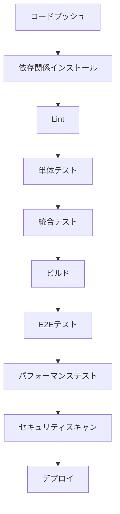
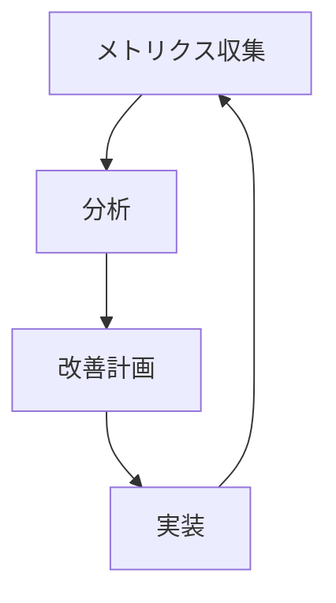

# HugMeDoテスト戦略

**作成日**: 2025年3月21日  
**最終更新**: 2025年3月21日  
**バージョン**: 1.0.0

## 概要

この文書は、HugMeDoプロジェクトのテスト戦略を定義します。HugMeDoは医療情報を扱うプラットフォームであるため、高い品質と信頼性が求められます。本テスト戦略は、開発プロセス全体を通じて品質を確保するための包括的なアプローチを提供します。

## テストの目的

1. **品質保証**
   - バグの早期発見と修正
   - 要件への適合性の確認
   - ユーザー体験の向上

2. **リスク軽減**
   - 重大な障害の防止
   - セキュリティ脆弱性の検出
   - パフォーマンス問題の特定

3. **開発効率の向上**
   - 回帰テストの自動化
   - 迅速なフィードバック
   - 技術的負債の削減

## テストピラミッド

HugMeDoでは、テストピラミッドの考え方に基づいてテストを構成します：

```
    /\
   /  \
  /E2E \
 /------\
/  統合   \
/----------\
/   単体    \
/--------------\
```

1. **単体テスト（基盤）**: 最も数が多く、実行が高速
2. **統合テスト（中間）**: 中程度の数と実行速度
3. **E2Eテスト（頂点）**: 最も数が少なく、実行が低速

## テスト種類と責任範囲

### 1. 単体テスト

**目的**: 個々のコンポーネントやユニットが期待通りに動作することを確認

**対象**:
- 関数/メソッド
- クラス
- コンポーネント
- ユーティリティ

**ツール**:
- Vitest（JavaScript/TypeScript）
- Testing Library（Svelte）

**責任者**: 開発者

**実行タイミング**:
- ローカル開発時
- コミット前
- CI/CDパイプライン

**カバレッジ目標**:
- コア機能: 80%以上
- ビジネスロジック: 90%以上
- ユーティリティ: 70%以上

**例**:

```typescript
// sum.ts
export function sum(a: number, b: number): number {
  return a + b;
}

// sum.test.ts
import { describe, it, expect } from 'vitest';
import { sum } from './sum';

describe('sum', () => {
  it('adds two numbers correctly', () => {
    expect(sum(1, 2)).toBe(3);
  });

  it('handles negative numbers', () => {
    expect(sum(-1, -2)).toBe(-3);
  });
});
```

### 2. 統合テスト

**目的**: 複数のコンポーネントやモジュールが連携して正しく動作することを確認

**対象**:
- API連携
- データベース操作
- モジュール間連携
- 状態管理

**ツール**:
- Vitest
- Supertest（APIテスト）
- MSW（モックサービスワーカー）

**責任者**: 開発者、QAエンジニア

**実行タイミング**:
- 機能実装完了時
- プルリクエスト時
- CI/CDパイプライン

**カバレッジ目標**:
- 主要フロー: 70%以上
- クリティカルパス: 85%以上

**例**:

```typescript
// api.test.ts
import { describe, it, expect, beforeAll, afterAll } from 'vitest';
import { setupServer } from 'msw/node';
import { rest } from 'msw';
import { fetchUserData } from './api';

const server = setupServer(
  rest.get('/api/users/1', (req, res, ctx) => {
    return res(ctx.json({ id: 1, name: '山田太郎' }));
  })
);

beforeAll(() => server.listen());
afterAll(() => server.close());

describe('API', () => {
  it('fetches user data correctly', async () => {
    const user = await fetchUserData(1);
    expect(user).toEqual({ id: 1, name: '山田太郎' });
  });
});
```

### 3. E2Eテスト

**目的**: 実際のユーザーシナリオに沿ってシステム全体が正しく動作することを確認

**対象**:
- ユーザーフロー
- クリティカルパス
- 主要機能

**ツール**:
- Playwright

**責任者**: QAエンジニア、開発者

**実行タイミング**:
- 機能実装完了時
- リリース前
- 定期的な回帰テスト

**カバレッジ目標**:
- クリティカルパス: 100%
- 主要ユーザーフロー: 90%以上

**例**:

```typescript
// login.spec.ts
import { test, expect } from '@playwright/test';

test('ユーザーがログインできること', async ({ page }) => {
  await page.goto('/login');
  
  await page.fill('input[name="email"]', 'test@example.com');
  await page.fill('input[name="password"]', 'password123');
  await page.click('button[type="submit"]');
  
  await page.waitForURL('/dashboard');
  
  const welcomeMessage = await page.textContent('.welcome-message');
  expect(welcomeMessage).toContain('ようこそ');
});
```

### 4. パフォーマンステスト

**目的**: システムのパフォーマンス特性を評価し、ボトルネックを特定

**対象**:
- 応答時間
- スループット
- リソース使用率
- スケーラビリティ

**ツール**:
- k6
- Lighthouse

**責任者**: パフォーマンスエンジニア、開発者

**実行タイミング**:
- 主要機能実装後
- リリース前
- 定期的な監視

**目標**:
- API応答時間: 200ms以下（95パーセンタイル）
- ページロード時間: 2秒以下
- Time to Interactive: 3秒以下

**例**:

```javascript
// performance.js (k6)
import http from 'k6/http';
import { check, sleep } from 'k6';

export const options = {
  vus: 100,
  duration: '30s',
};

export default function() {
  const res = http.get('https://staging.hugmedo.com/api/health');
  check(res, {
    'ステータスコードが200': (r) => r.status === 200,
    '応答時間が200ms未満': (r) => r.timings.duration < 200,
  });
  sleep(1);
}
```

### 5. セキュリティテスト

**目的**: セキュリティ脆弱性を特定し、データ保護を確保

**対象**:
- 認証・認可
- 入力バリデーション
- データ暗号化
- セッション管理

**ツール**:
- OWASP ZAP
- npm audit
- Snyk

**責任者**: セキュリティエンジニア、開発者

**実行タイミング**:
- セキュリティ関連機能実装後
- リリース前
- 定期的な脆弱性スキャン

**目標**:
- 重大な脆弱性: 0
- 中程度の脆弱性: 解決計画あり
- 依存関係の脆弱性: 定期的に修正

### 6. アクセシビリティテスト

**目的**: アプリケーションが多様なユーザーにとってアクセス可能であることを確認

**対象**:
- キーボードナビゲーション
- スクリーンリーダー対応
- コントラスト比
- フォーカス管理

**ツール**:
- axe-core
- Lighthouse

**責任者**: UIデザイナー、フロントエンド開発者

**実行タイミング**:
- UI実装後
- リリース前

**目標**:
- WCAG 2.1 AA準拠

## テスト環境

### 1. 開発環境

- **目的**: 開発者のローカル環境でのテスト
- **構成**: Docker Compose
- **データ**: テスト用データセット
- **アクセス**: 開発者のみ

### 2. CI/CD環境

- **目的**: 自動テストの実行
- **構成**: GitHub Actions
- **データ**: テスト用データセット
- **アクセス**: 開発チーム

### 3. ステージング環境

- **目的**: 本番に近い環境でのテスト
- **構成**: 本番環境と同等
- **データ**: 匿名化された本番データ
- **アクセス**: 開発チーム、QAチーム、ステークホルダー

## テスト自動化

### 1. CI/CDパイプライン



### 2. テスト実行コマンド

```bash
# 単体テスト
pnpm test

# 特定のモジュールの単体テスト
pnpm test --filter=@hugmedo/chat

# 統合テスト
pnpm test:integration

# E2Eテスト
pnpm test:e2e

# 全テスト実行
pnpm test:all

# カバレッジレポート生成
pnpm test:coverage
```

### 3. テスト結果の可視化

- **テストレポート**: JUnit XML形式
- **カバレッジレポート**: Istanbul/NYC
- **ダッシュボード**: GitHub Actions Summary

## テストデータ管理

### 1. テストデータの種類

- **モックデータ**: 単体テスト用
- **フィクスチャ**: 統合テスト用
- **シードデータ**: E2Eテスト用
- **匿名化データ**: パフォーマンステスト用

### 2. テストデータ生成

- **ファクトリー**: テストデータの動的生成
- **シーダー**: データベースの初期化
- **匿名化ツール**: 本番データの匿名化

### 3. テストデータの保存場所

- **ソースコード管理**: モックデータ、フィクスチャ
- **S3/MinIO**: 大規模テストデータ
- **CI/CD環境**: 一時的なテストデータ

## モック戦略

### 1. 外部依存のモック

- **API**: MSW（Mock Service Worker）
- **データベース**: テスト用インメモリDB
- **認証**: モック認証サービス

### 2. モックの粒度

- **浅いモック**: 外部境界のみ
- **深いモック**: 内部コンポーネントも含む

### 3. モック実装例

```typescript
// auth.mock.ts
import { vi } from 'vitest';

export const mockAuthService = {
  login: vi.fn().mockResolvedValue({ success: true, userId: '123' }),
  logout: vi.fn().mockResolvedValue({ success: true }),
  getCurrentUser: vi.fn().mockResolvedValue({
    id: '123',
    name: '山田太郎',
    email: 'yamada@example.com',
    role: 'DOCTOR'
  })
};
```

## テスト駆動開発（TDD）

HugMeDoでは、コア機能とビジネスロジックに対してTDDを推奨します：

1. **赤**: 失敗するテストを書く
2. **緑**: テストが通るように最小限のコードを書く
3. **リファクタリング**: コードを改善する（テストは通ったまま）

### TDDの適用範囲

- **推奨**: ビジネスロジック、ユーティリティ関数、API
- **任意**: UI、統合ポイント

## バグ修正のテスト戦略

1. **再現テスト**: バグを再現するテストを作成
2. **修正**: バグを修正
3. **検証**: テストが通ることを確認
4. **回帰テスト**: 他の機能に影響がないことを確認

## テスト計画

### 1. テスト計画書

各機能実装前に、以下を含むテスト計画書を作成します：

- テスト対象機能
- テストシナリオ
- テスト条件
- 期待される結果
- テスト優先度

### 2. テストマトリックス

機能とテスト種類のマトリックスを作成し、テストカバレッジを可視化します：

| 機能 | 単体 | 統合 | E2E | パフォーマンス | セキュリティ |
|-----|-----|-----|-----|------------|---------|
| 認証 | ✅ | ✅ | ✅ | ✅ | ✅ |
| ビデオチャット | ✅ | ✅ | ✅ | ✅ | ✅ |
| チャット | ✅ | ✅ | ✅ | ✅ | ✅ |
| 予約管理 | ✅ | ✅ | ✅ | ❌ | ✅ |

## 継続的品質改善

### 1. テスト品質メトリクス

- **テストカバレッジ**: コード行、分岐、関数
- **テスト実行時間**: CI/CDパイプラインの効率
- **欠陥検出率**: テストで発見されたバグの割合
- **テスト安定性**: フレーキーテストの割合

### 2. テスト改善サイクル



### 3. テストレビュー

- **コードレビュー**: テストコードのレビュー
- **テスト戦略レビュー**: 四半期ごとのテスト戦略の見直し
- **テスト結果レビュー**: テスト結果の分析と改善

## 医療情報システムとしての特別なテスト要件

HugMeDoは医療情報を扱うシステムであるため、以下の特別なテスト要件があります：

### 1. データプライバシーテスト

- 個人情報の適切な取り扱い
- データアクセス制御の検証
- データ漏洩防止策の検証

### 2. コンプライアンステスト

- 医療情報システムガイドラインへの準拠
- 個人情報保護法への対応
- 監査ログの検証

### 3. 信頼性テスト

- 高可用性の検証
- データ整合性の検証
- バックアップと復旧の検証

## テストドキュメント

### 1. テスト結果レポート

テスト実行後、以下を含むレポートを生成します：

- テスト概要
- テスト結果サマリー
- 失敗したテスト
- カバレッジ情報
- 改善提案

### 2. テスト証跡

規制対応のため、以下の証跡を保存します：

- テスト計画書
- テスト結果
- 不具合報告
- 修正確認結果

## 役割と責任

### 1. 開発者

- 単体テストの作成と実行
- 統合テストの作成と実行
- テスト自動化の実装
- コードレビューでのテスト品質確認

### 2. QAエンジニア

- テスト計画の作成
- E2Eテストの作成と実行
- 手動テストの実施
- バグ報告と追跡

### 3. DevOpsエンジニア

- テスト環境の構築と維持
- CI/CDパイプラインの最適化
- テスト実行の監視
- テスト結果の集計と報告

## トレーニングと知識共有

### 1. テストスキル向上

- テスト技術に関するワークショップ
- ペアプログラミングとペアテスト
- テストベストプラクティスの共有

### 2. ドキュメントとリソース

- テストガイドライン
- テストパターン集
- テストツールのドキュメント

## 変更履歴

### v0.0.0 (2025-03-21)
- 初期バージョン
- テスト戦略の定義
- テスト種類と責任範囲の詳細化
