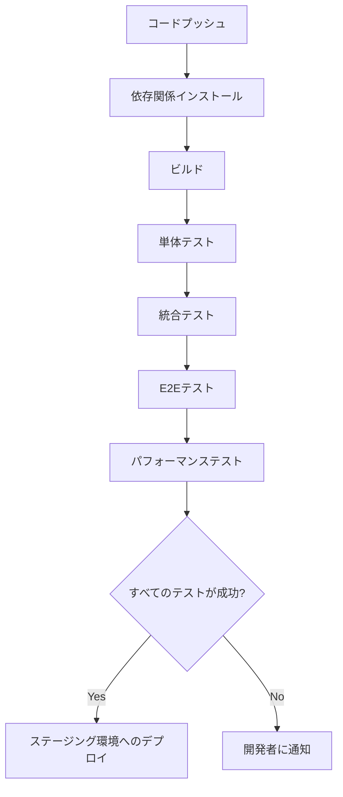
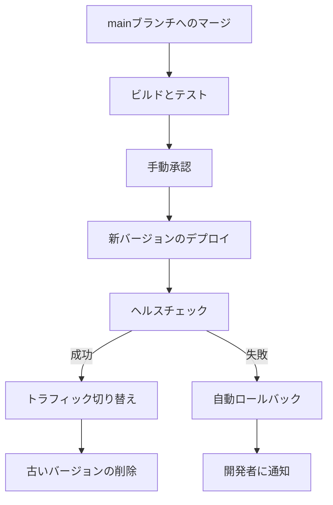

# HugMeDoデプロイ戦略

**作成日**: 2025年3月21日  
**最終更新**: 2025年3月21日  
**バージョン**: 1.0.0

## 概要

この文書は、HugMeDoプロジェクトのデプロイ戦略を定義します。HugMeDoはコンテナ化モジュラーモノリスアーキテクチャを採用しており、Docker Composeを使用した開発環境から本番環境へのスムーズな移行パスを提供します。

## コンテナ化モジュラーモノリスアーキテクチャとは

コンテナ化モジュラーモノリスアーキテクチャは、以下の特徴を持つアーキテクチャです：

1. **水平スケーラビリティ** - 負荷に応じてコンテナを水平にスケールアウト可能
2. **API駆動** - すべてのモジュール間の通信は明確に定義されたAPIを通じて行われる
3. **回復力** - 障害に対する耐性を持ち、自動復旧メカニズムを備える
4. **コンテナ化** - すべてのコンポーネントはDockerコンテナとして実装される

## デプロイ環境

HugMeDoは以下の環境を定義しています：

1. **開発環境（ローカル）** - 開発者のローカルマシン上でDocker Composeを使用
2. **テスト環境** - CI/CDパイプラインで自動テストを実行するための環境
3. **ステージング環境** - 本番環境と同等の構成でテストを行うための環境
4. **本番環境** - エンドユーザーが利用する実際のサービス環境

## 開発環境（ローカル）

### 構成

開発環境は以下のコンポーネントで構成されます：

```
+----------------------------------+
|        Docker Compose            |
| +-------------+ +-------------+  |
| |  Webアプリ   | | モバイルアプリ |  |
| | (SvelteKit) | | (SvelteKit) |  |
| +-------------+ +-------------+  |
|        |              |          |
| +-------------+ +-------------+  |
| |  APIサーバー | |  データベース |  |
| |   (Node.js)  | |  (PostgreSQL) |  |
| +-------------+ +-------------+  |
|        |              |          |
| +-------------+ +-------------+  |
| | チャットモジュール | OHRモジュール |  |
| +-------------+ +-------------+  |
+----------------------------------+
```

### セットアップ手順

1. リポジトリのクローン
   ```bash
   git clone https://github.com/your-org/hugmedo.git
   cd hugmedo
   ```

2. 環境変数の設定
   ```bash
   cp .env.example .env.local
   # .env.localを編集して必要な環境変数を設定
   ```

3. Docker Composeでの起動
   ```bash
   pnpm run docker:dev
   ```

4. アクセス
   - Webアプリ: http://localhost:3000
   - モバイルアプリ: http://localhost:3100
   - APIドキュメント: http://localhost:3000/api/docs

## テスト環境

テスト環境はGitHub Actionsを使用して自動的に構築され、以下のテストが実行されます：

1. 単体テスト（Vitest）
2. 統合テスト
3. E2Eテスト（Playwright）
4. パフォーマンステスト

### CI/CDパイプライン



## ステージング環境

ステージング環境は本番環境と同等の構成で、以下の目的で使用されます：

1. 機能テスト
2. 負荷テスト
3. セキュリティテスト
4. ユーザー受け入れテスト（UAT）

### インフラストラクチャ

ステージング環境は、AWS ECSを使用して構築されます：

```
+----------------------------------+
|            AWS ECS               |
| +-------------+ +-------------+  |
| |  Webアプリ   | | モバイルアプリ |  |
| |  コンテナ    | |   コンテナ    |  |
| +-------------+ +-------------+  |
|        |              |          |
| +-------------+ +-------------+  |
| |  APIサーバー | |  データベース |  |
| |   コンテナ   | |   コンテナ    |  |
| +-------------+ +-------------+  |
|        |              |          |
| +-------------+ +-------------+  |
| | チャットモジュール | OHRモジュール |  |
| |   コンテナ   | |   コンテナ    |  |
| +-------------+ +-------------+  |
+----------------------------------+
```

### デプロイプロセス

1. `develop`ブランチへのマージ後、自動的にステージング環境にデプロイ
2. 手動承認ステップを経て、ステージング環境でのテスト実行
3. テスト結果のレポート生成と開発チームへの共有

## 本番環境

本番環境は、高可用性と拡張性を確保するために、AWS ECSとAWS Fargateを使用して構築されます。

### インフラストラクチャ

```
+------------------------------------------+
|               AWS Cloud                  |
| +----------------+ +----------------+    |
| |   Route 53     | |  CloudFront    |    |
| | (DNSルーティング) | |    (CDN)      |    |
| +----------------+ +----------------+    |
|          |                 |             |
| +----------------+ +----------------+    |
| |  Application   | |   WAF          |    |
| |  Load Balancer | | (Webファイアウォール) |    |
| +----------------+ +----------------+    |
|          |                               |
| +----------------------------------+     |
| |            ECS Cluster           |     |
| | +-------------+ +-------------+  |     |
| | |  Webアプリ   | | モバイルアプリ |  |     |
| | |  コンテナ    | |   コンテナ    |  |     |
| | +-------------+ +-------------+  |     |
| |        |              |          |     |
| | +-------------+ +-------------+  |     |
| | |  APIサーバー | |  その他の    |  |     |
| | |   コンテナ   | |  マイクロサービス |  |     |
| | +-------------+ +-------------+  |     |
| +----------------------------------+     |
|          |                |              |
| +----------------+ +----------------+    |
| |  RDS Aurora    | |  ElastiCache   |    |
| | (PostgreSQL)   | |    (Redis)     |    |
| +----------------+ +----------------+    |
|          |                |              |
| +----------------+ +----------------+    |
| |     S3         | |   CloudWatch   |    |
| | (ストレージ)    | | (モニタリング)  |    |
| +----------------+ +----------------+    |
+------------------------------------------+
```

### スケーリング戦略

1. **自動スケーリング**
   - CPU使用率が70%を超えた場合に自動的にコンテナ数を増加
   - メモリ使用率が80%を超えた場合に自動的にコンテナ数を増加
   - 最小2インスタンス、最大10インスタンスで構成

2. **データベーススケーリング**
   - RDS Auroraの自動スケーリング機能を使用
   - 読み取りレプリカを複数リージョンに配置

3. **キャッシュ戦略**
   - ElastiCacheを使用したセッションデータとAPIレスポンスのキャッシュ
   - CloudFrontを使用した静的アセットのキャッシュ

### デプロイプロセス

1. `main`ブランチへのマージ後、自動的にビルドとテストを実行
2. 手動承認ステップを経て、本番環境へのデプロイを開始
3. Blue/Greenデプロイメント戦略を使用して無停止デプロイを実現
4. デプロイ後の自動ヘルスチェックと必要に応じたロールバック



## 障害復旧（DR）戦略

### バックアップ

1. **データベース**
   - 自動日次バックアップ（保持期間: 30日）
   - ポイントインタイムリカバリ（PITR）の有効化（最大35日前まで）
   - クロスリージョンバックアップの実施

2. **アプリケーションデータ**
   - S3のバージョニング機能を使用した自動バックアップ
   - クロスリージョンレプリケーションの設定

### 災害復旧

1. **リージョン障害**
   - セカンダリリージョン（大阪リージョン）へのフェイルオーバー
   - Route 53のDNSフェイルオーバー機能を使用

2. **復旧時間目標（RTO）**
   - Tier 1サービス（認証、基本機能）: 15分以内
   - Tier 2サービス（チャット、ビデオ通話）: 30分以内
   - Tier 3サービス（分析、レポート）: 60分以内

3. **復旧ポイント目標（RPO）**
   - 重要データ: 5分以内
   - 通常データ: 24時間以内

## モニタリングと運用

### モニタリングツール

1. **AWS CloudWatch**
   - インフラストラクチャメトリクス（CPU、メモリ、ディスク使用率）
   - アプリケーションログ
   - カスタムメトリクス（API応答時間、エラーレートなど）

2. **AWS X-Ray**
   - 分散トレーシング
   - パフォーマンスボトルネックの特定

3. **Datadog**
   - エンドツーエンドのモニタリング
   - リアルタイムダッシュボード
   - アラート設定

### アラート戦略

1. **重大度レベル**
   - P1: サービス全体の障害（即時対応）
   - P2: 一部機能の障害（1時間以内に対応）
   - P3: パフォーマンス低下（24時間以内に対応）
   - P4: 軽微な問題（次回のスプリントで対応）

2. **通知チャネル**
   - Slack
   - メール
   - SMS（P1アラートのみ）

### 運用手順

1. **インシデント対応**
   - インシデント検出
   - トリアージと重大度の判定
   - 対応チームの編成
   - 解決と事後分析

2. **定期メンテナンス**
   - セキュリティパッチの適用（月次）
   - データベースメンテナンス（週次）
   - パフォーマンスチューニング（月次）

## セキュリティ対策

1. **ネットワークセキュリティ**
   - VPC内でのセグメンテーション
   - セキュリティグループによるアクセス制限
   - WAFによるWebアプリケーション保護

2. **データセキュリティ**
   - 保存データの暗号化（AES-256）
   - 転送中のデータの暗号化（TLS 1.3）
   - KMSを使用した鍵管理

3. **アクセス管理**
   - IAMによる最小権限の原則の適用
   - 多要素認証（MFA）の強制
   - 特権アクセスの監査ログ記録

4. **コンプライアンス**
   - 医療情報システムのセキュリティガイドラインへの準拠
   - 個人情報保護法への対応
   - 定期的なセキュリティ監査の実施

## 移行戦略（AWS Amplifyからの移行）

HugMeDoは当初AWS Amplifyを使用していましたが、コンテナ化モジュラーモノリスアーキテクチャへの移行に伴い、以下の段階的な移行戦略を採用します。

### フェーズ1: 並行運用（2025年4月〜5月）

1. コンテナ化モジュラーモノリスアーキテクチャの基盤構築
2. 既存のAmplify環境と並行して新環境を構築
3. 新機能は新環境で開発

### フェーズ2: データ移行（2025年6月）

1. データベースのスキーマ変換ツールの開発
2. テスト環境でのデータ移行テスト
3. 移行リハーサルの実施

### フェーズ3: 切り替え（2025年7月）

1. 短時間のダウンタイムを伴う本番環境の切り替え
2. 新環境への完全移行
3. 古い環境の段階的な廃止

### フェーズ4: 最適化（2025年8月〜）

1. パフォーマンスチューニング
2. スケーリング設定の最適化
3. コスト最適化

## コスト最適化

1. **リザーブドインスタンス**
   - 基本負荷に対するリザーブドインスタンスの購入
   - 変動負荷に対するスポットインスタンスの使用

2. **自動スケーリング**
   - 使用パターンに基づく自動スケーリングの設定
   - 夜間や週末の低負荷時間帯でのスケールダウン

3. **ストレージ最適化**
   - S3ライフサイクルポリシーの設定
   - 古いデータのコールドストレージへの移行

4. **モニタリングとアラート**
   - コスト超過アラートの設定
   - 未使用リソースの定期的な特定と削除

## 将来の拡張性

1. **グローバル展開**
   - マルチリージョンデプロイメントの準備
   - グローバルアクセラレータの導入

2. **マイクロサービス化**
   - 必要に応じた特定モジュールのマイクロサービス化
   - サービスメッシュ（AWS App Mesh）の導入

3. **AI/ML機能の統合**
   - SageMakerを使用した分析機能の強化
   - リアルタイム予測モデルの導入

4. **IoTデバイス連携**
   - 医療IoTデバイスとの連携
   - AWS IoTを使用したデバイス管理

## 変更履歴

### v0.0.0 (2025-03-21)
- 初期バージョン
- コンテナ化モジュラーモノリスアーキテクチャのデプロイ戦略の定義
- AWS Amplifyからの移行計画の策定
