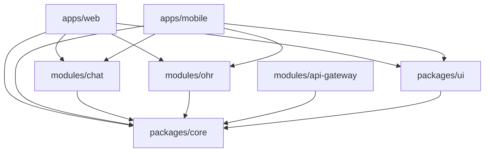
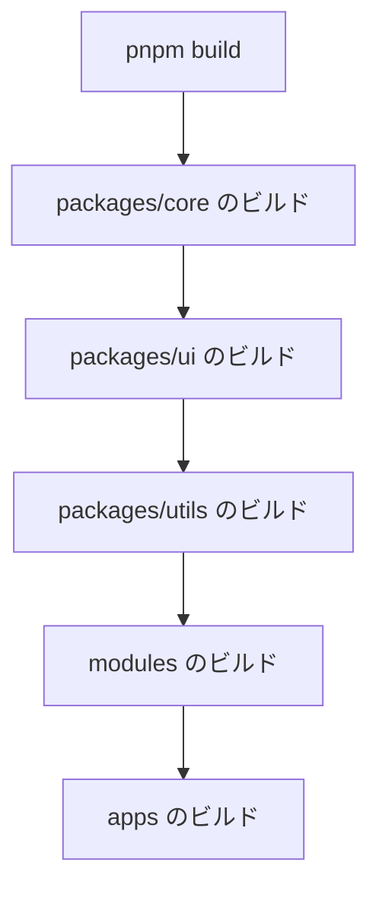

# HugMeDoモジュール構造

**作成日**: 2025年3月21日  
**最終更新**: 2025年3月21日  
**バージョン**: 1.0.0

## 概要

この文書は、HugMeDoプロジェクトのモジュール構造と依存関係を定義します。HugMeDoはpnpmワークスペースを使用したモノレポ構造を採用しており、複数のアプリケーション、共有モジュール、パッケージで構成されています。

## ディレクトリ構造

```
HugMeDo/
├── apps/               # アプリケーション
│   ├── web/            # Webアプリケーション (SvelteKit)
│   └── mobile/         # モバイルアプリケーション (SvelteKit)
├── modules/            # 機能モジュール
│   ├── api-gateway/    # APIゲートウェイ（認証実装を含む）
│   ├── chat/           # チャットモジュール
│   ├── ohr/            # オンライン医務室モジュール
│   └── halca/          # HALCAモジュール (計画中)
├── packages/           # 共有パッケージ
│   ├── core/           # コアライブラリ
│   │   ├── src/
│   │   │   ├── auth/   # 認証関連のインターフェースと型
│   │   │   ├── api/    # API関連のユーティリティ
│   │   │   └── types/  # 型定義
│   │   └── package.json
│   ├── ui/             # UIコンポーネントライブラリ
│   └── utils/          # ユーティリティ関数
├── docker/             # Dockerコンテナ定義
│   ├── grafana/        # Grafana設定
│   ├── nginx/          # Nginx設定
│   ├── postgres/       # PostgreSQL設定
│   └── prometheus/     # Prometheus設定
├── documents/          # ドキュメント
│   ├── api/            # API仕様書
│   ├── architecture/   # アーキテクチャドキュメント
│   ├── decisions/      # 設計決定記録
│   ├── guides/         # 開発ガイド
│   └── log/            # 開発ログ
└── scripts/            # ビルド・開発スクリプト
```

## モジュール依存関係



## モジュール詳細

### アプリケーション (apps/)

#### Web アプリケーション (apps/web/)

Webブラウザ向けのメインアプリケーションです。

- **技術スタック**: SvelteKit, TypeScript, TailwindCSS
- **責任**: 
  - ユーザーインターフェース
  - ルーティング
  - 状態管理
  - モジュール統合
- **主要コンポーネント**:
  - ダッシュボード
  - ログイン/認証
  - ナビゲーション
  - モジュールコンテナ

#### モバイルアプリケーション (apps/mobile/)

モバイルデバイス向けのアプリケーションです。

- **技術スタック**: SvelteKit, TypeScript, TailwindCSS
- **責任**: 
  - モバイル最適化UI
  - オフライン対応
  - プッシュ通知
  - デバイス機能連携
- **主要コンポーネント**:
  - モバイル向けダッシュボード
  - オフラインモード
  - 通知管理
  - カメラ/マイク連携

### 機能モジュール (modules/)

#### APIゲートウェイモジュール (modules/api-gateway/)

APIのエントリーポイントを提供し、認証と認可を実装します。

- **技術スタック**: Svelte, TypeScript, Express.js
- **責任**: 
  - APIエンドポイントの定義
  - 認証と認可
  - APIリクエストのルーティング
- **主要コンポーネント**:
  - APIGateway
  - AuthMiddleware
  - RouteConfig

#### チャットモジュール (modules/chat/)

テキストベースのコミュニケーション機能を提供します。

- **技術スタック**: Svelte, TypeScript, WebSocket
- **責任**: 
  - メッセージング機能
  - リアルタイム通信
  - 添付ファイル管理
- **主要コンポーネント**:
  - ChatRoom
  - MessageList
  - MessageInput
  - AttachmentUploader

#### オンライン医務室モジュール (modules/ohr/)

ビデオ通話とオンライン診療機能を提供します。

- **技術スタック**: Svelte, TypeScript, Amazon Chime SDK, WebRTC
- **責任**: 
  - ビデオ通話
  - 画面共有
  - 予約管理
  - 診療記録
- **主要コンポーネント**:
  - VideoRoom
  - MeetingControls
  - AppointmentScheduler
  - MedicalRecordViewer

#### HALCA モジュール (modules/halca/) - 計画中

メンタルヘルススクリーニングのためのAIチャット機能を提供します。

- **技術スタック**: Svelte, TypeScript, OpenAI API
- **責任**: 
  - AIチャットインターフェース
  - スクリーニング評価
  - レポート生成
- **主要コンポーネント**:
  - AIChat
  - ScreeningForm
  - ResultsViewer
  - ReportGenerator

### 共有パッケージ (packages/)

#### コアライブラリ (packages/core/)

システム全体で共有される基本的な型、インターフェース、ユーティリティを提供します。

- **技術スタック**: TypeScript
- **責任**: 
  - 認証インターフェース
  - API基盤
  - 共通型定義
  - エラーハンドリング
- **主要コンポーネント**:
  - AuthInterface
  - ApiClient
  - ErrorTypes
  - CommonModels

#### UIコンポーネントライブラリ (packages/ui/)

再利用可能なUIコンポーネントを提供します。

- **技術スタック**: Svelte, TypeScript, TailwindCSS
- **責任**: 
  - 共通UIコンポーネント
  - テーマ管理
  - アクセシビリティ対応
- **主要コンポーネント**:
  - Button
  - Card
  - Modal
  - Form
  - LoadingSpinner
  - LoginForm

#### ユーティリティ関数 (packages/utils/)

共通のユーティリティ関数を提供します。

- **技術スタック**: TypeScript
- **責任**: 
  - 日付操作
  - 文字列操作
  - バリデーション
  - フォーマット
- **主要関数**:
  - formatDate
  - validateInput
  - debounce
  - throttle
  - createLogger

## アーキテクチャ概要

HugMeDoプロジェクトは、コンテナ化モジュラーモノリスアーキテクチャを採用しています。このアーキテクチャでは、アプリケーションを論理的に分離されたモジュールに分割しながらも、単一のデプロイ単位として扱います。

## モジュール間通信

HugMeDoでは、モジュール間の通信に以下のパターンを採用しています：

1. **直接インポート**
   - コアモジュールと共有パッケージは直接インポートして使用
   - 例: `import { Button } from '@hugmedo/ui'`

2. **イベントバス**
   - 疎結合なモジュール間通信にはイベントバスを使用
   - 例: `eventBus.emit('meeting:started', { meetingId: '123' })`

3. **ストア**
   - 共有状態の管理にはSvelteストアを使用
   - 例: `import { user } from '@hugmedo/core'`

4. **コンテキスト**
   - 親子コンポーネント間の通信にはSvelteコンテキストを使用
   - 例: `setContext('theme', { ... })`

## ビルドプロセス

HugMeDoは、Turboを使用したビルドプロセスを採用しています：



### ビルドコマンド

```bash
# 全体のビルド
pnpm build

# 特定のパッケージのビルド
pnpm build --filter=@hugmedo/ui

# 開発サーバーの起動
pnpm dev

# テストの実行
pnpm test
```

## パッケージ依存関係

```json
{
  "dependencies": {
    "@hugmedo/core": "workspace:*",
    "@hugmedo/ui": "workspace:*",
    "@hugmedo/chat": "workspace:*",
    "@hugmedo/ohr": "workspace:*"
  },
  "devDependencies": {
    "@hugmedo/config": "workspace:*",
    "@hugmedo/utils": "workspace:*"
  }
}
```

## モジュール開発ガイドライン

### 新しいモジュールの追加

1. モジュールディレクトリの作成
   ```bash
   mkdir -p modules/new-module/src
   ```

2. パッケージ設定の作成
   ```bash
   cat > modules/new-module/package.json << EOF
   {
     "name": "@hugmedo/new-module",
     "version": "0.1.0",
     "private": true,
     "main": "dist/index.js",
     "types": "dist/index.d.ts",
     "scripts": {
       "build": "tsc",
       "dev": "tsc -w",
       "test": "vitest"
     },
     "dependencies": {
       "@hugmedo/core": "workspace:*",
       "@hugmedo/ui": "workspace:*"
     },
     "devDependencies": {
       "@hugmedo/config": "workspace:*",
       "typescript": "^5.0.0",
       "vite": "^4.0.0",
       "vitest": "^0.30.0"
     }
   }
   EOF
   ```

3. TypeScript設定の作成
   ```bash
   cat > modules/new-module/tsconfig.json << EOF
   {
     "extends": "../../tsconfig.json",
     "compilerOptions": {
       "outDir": "./dist",
       "rootDir": "./src"
     },
     "include": ["src/**/*"]
   }
   EOF
   ```

4. モジュールのインストール
   ```bash
   pnpm install
   ```

### モジュールの公開インターフェース

各モジュールは、`src/index.ts`ファイルで公開インターフェースを定義します：

```typescript
// src/index.ts
export * from './components';
export * from './hooks';
export * from './store';
export * from './types';
```

### モジュールテスト

各モジュールには、以下のテストを含める必要があります：

1. **単体テスト**
   - コンポーネント
   - ユーティリティ関数
   - ストア

2. **統合テスト**
   - モジュール内の複数コンポーネントの連携

3. **E2Eテスト**
   - 実際のユーザーフローをシミュレート

```typescript
// src/__tests__/Component.test.ts
import { render, screen } from '@testing-library/svelte';
import Component from '../Component.svelte';

describe('Component', () => {
  it('renders correctly', () => {
    render(Component, { props: { ... } });
    expect(screen.getByText('...')).toBeInTheDocument();
  });
});
```

## モジュール間の依存関係管理

### 依存関係の方向性

```
apps → modules → core
packages ← modules
packages ← apps
```

- アプリケーションはモジュールに依存する
- モジュールはコアに依存する
- パッケージはモジュールとアプリケーションから使用される
- モジュール間の直接依存は最小限に抑える

### 循環依存の防止

- 明確な責任分担
- インターフェースの抽象化
- イベントベースの通信
- 依存関係の定期的な監査

## 変更履歴

### v0.0.0 (2025-03-21)
- 初期バージョン
- モジュール構造の定義
- 依存関係の文書化
