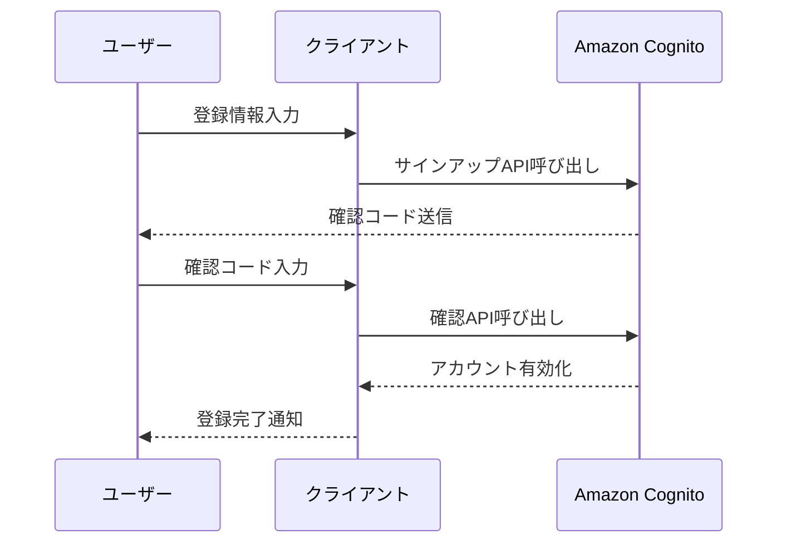
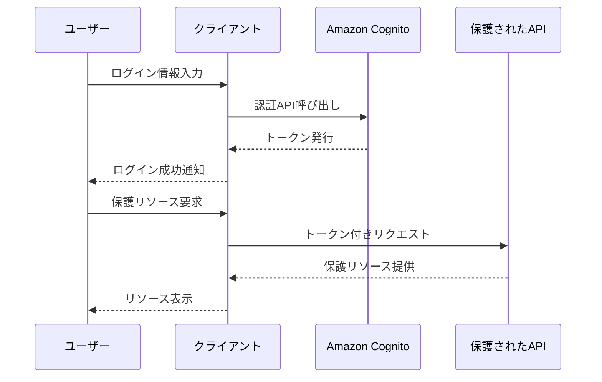
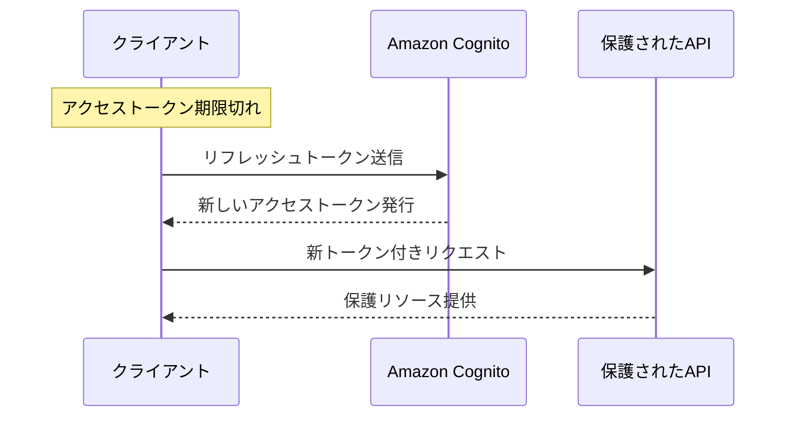

# HugMeDo 認証フロー

## 概要

HugMeDoプロジェクトでは、Amazon Cognitoを使用したセキュアな認証システムを実装しています。このドキュメントでは、認証フローの詳細と実装方法について説明します。

## 認証アーキテクチャ

```
┌─────────────────┐      ┌─────────────────┐      ┌─────────────────┐
│                 │      │                 │      │                 │
│  クライアント    │◄────►│  認証サービス    │◄────►│  Amazon Cognito  │
│  (SvelteKit 2)  │      │  (API Gateway)  │      │  User Pool      │
│                 │      │                 │      │                 │
└─────────────────┘      └─────────────────┘      └─────────────────┘
        │                                                  │
        │                                                  │
        ▼                                                  ▼
┌─────────────────┐                              ┌─────────────────┐
│                 │                              │                 │
│  保護されたAPI   │                              │  ユーザー情報DB  │
│  (各モジュール)   │                              │  (DynamoDB)    │
│                 │                              │                 │
└─────────────────┘                              └─────────────────┘
```

## 認証フロー

### 1. ユーザー登録フロー

1. ユーザーが登録フォームに情報を入力
2. クライアントがCognitoのサインアップAPIを呼び出し
3. Cognitoがユーザーに確認コードを送信
4. ユーザーが確認コードを入力
5. クライアントがCognitoの確認APIを呼び出し
6. ユーザーアカウントが有効化



### 2. ログインフロー

1. ユーザーがログインフォームに認証情報を入力
2. クライアントがCognitoの認証APIを呼び出し
3. Cognitoが認証情報を検証
4. 認証成功時、Cognitoがアクセストークン、IDトークン、リフレッシュトークンを発行
5. クライアントがトークンを保存
6. 保護されたリソースへのアクセス時にトークンを使用



### 3. トークンリフレッシュフロー

1. アクセストークンの有効期限が切れる
2. クライアントがリフレッシュトークンを使用して新しいアクセストークンを取得
3. 新しいアクセストークンを使用して保護されたリソースにアクセス



## 実装詳細

### 1. Amazon Cognito設定

```json
{
  "UserPoolId": "ap-northeast-1_xxxxxxxx",
  "ClientId": "xxxxxxxxxxxxxxxxxxxxxxxxxx",
  "AuthFlow": "USER_PASSWORD_AUTH",
  "TokenValidityUnits": {
    "AccessToken": "minutes",
    "IdToken": "minutes",
    "RefreshToken": "days"
  },
  "TokenValidity": {
    "AccessToken": 60,
    "IdToken": 60,
    "RefreshToken": 30
  }
}
```

### 2. SvelteKit 2での実装

```typescript
// src/lib/auth/cognito.ts
import { CognitoIdentityProviderClient, InitiateAuthCommand } from '@aws-sdk/client-cognito-identity-provider';

const cognitoClient = new CognitoIdentityProviderClient({
  region: 'ap-northeast-1'
});

export async function signIn(username: string, password: string) {
  try {
    const command = new InitiateAuthCommand({
      AuthFlow: 'USER_PASSWORD_AUTH',
      ClientId: import.meta.env.VITE_COGNITO_CLIENT_ID,
      AuthParameters: {
        USERNAME: username,
        PASSWORD: password
      }
    });
    
    const response = await cognitoClient.send(command);
    return {
      accessToken: response.AuthenticationResult?.AccessToken,
      idToken: response.AuthenticationResult?.IdToken,
      refreshToken: response.AuthenticationResult?.RefreshToken
    };
  } catch (error) {
    console.error('認証エラー:', error);
    throw error;
  }
}
```

### 3. フックでの認証状態管理

```typescript
// src/hooks.server.ts
import { verifyToken } from '$lib/auth/jwt';
import type { Handle } from '@sveltejs/kit';

export const handle: Handle = async ({ event, resolve }) => {
  // JWTトークンからユーザー情報を取得
  const token = event.cookies.get('auth_token');
  if (token) {
    try {
      const decoded = await verifyToken(token);
      event.locals.user = {
        id: decoded.sub,
        name: decoded.name,
        role: decoded.role,
        authenticated: true
      };
    } catch (error) {
      // トークンが無効な場合はクッキーを削除
      event.cookies.delete('auth_token', { path: '/' });
    }
  }

  return resolve(event);
};
```

## セキュリティ考慮事項

1. **トークン保存**: クライアント側でのトークン保存には、HTTPOnly Cookieを使用し、XSS攻撃からの保護を強化
2. **CSRF対策**: リクエストにCSRFトークンを含め、クロスサイトリクエストフォージェリ攻撃を防止
3. **トークン有効期限**: アクセストークンの有効期限を短く設定し、セキュリティリスクを最小化
4. **セッション管理**: ユーザーログアウト時にはCognitoのグローバルサインアウトを実行し、すべてのデバイスでのセッションを終了
5. **MFA**: 多要素認証を実装し、認証セキュリティを強化
6. **ロギング**: 認証イベントをCloudWatchに記録し、セキュリティ監査を可能に

## 関連ドキュメント

- [セキュリティ設計](./security-design.md)
- [ユーザーロールと権限](./user-roles-and-permissions.md)
- [API仕様 - 認証API](../api/auth-api.md)

## バージョン情報
- 最終更新日: 2025/03/23
- バージョン: 1.0.0
